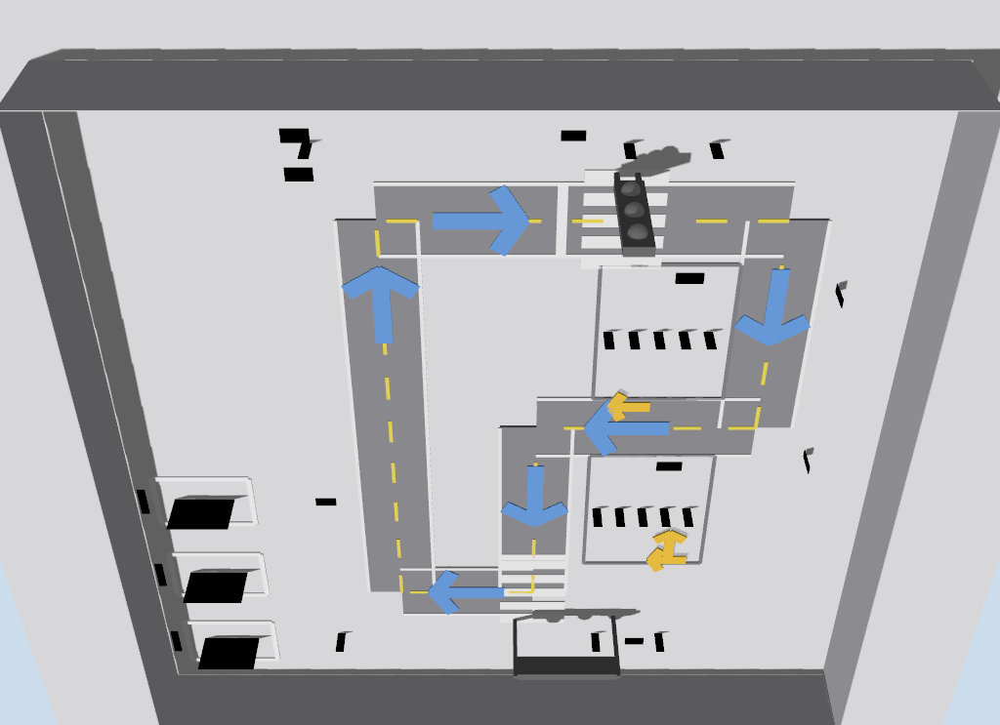
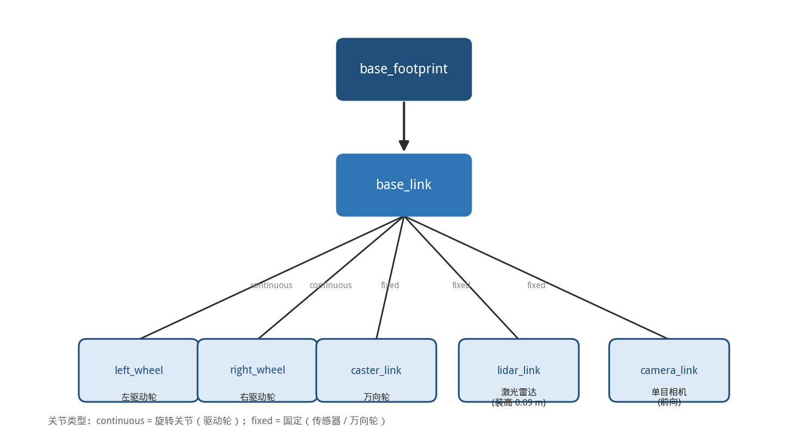
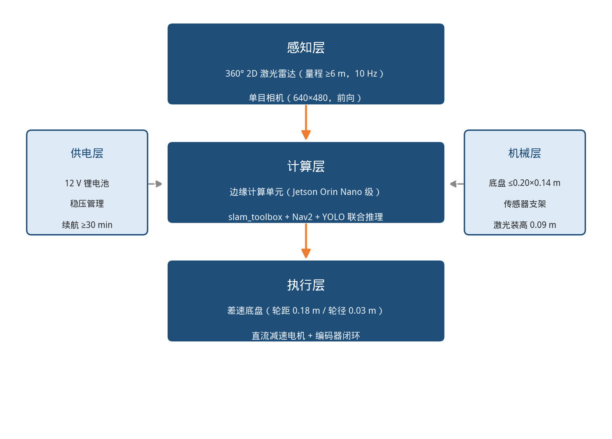

# WHC-智慧社区复赛技术方案

> **文档状态：初稿（导航章节已完成，其余章节待各负责人补充）**
>
> 使用方法：
> 1. 把所有 `【待填：…】` 换成真实内容或实测数据
> 2. 把 `[图 X：…]` 换成实际截图
> 3. 视觉组补 §4.8，仿真组补 §5.2
> 4. 全文排版统一后导出为 `WHC-智慧社区复赛技术方案.pdf`
>
> ⚠️ 规则要求"图文并茂，逻辑清晰，重点突出，软硬件整体设计"——
> **排版与规范占 5 分、文档质量占 5 分，别忽视格式。**

---

<div align="center">

# 智慧社区巡检机器人
## 技术方案设计文档

**参赛队伍：** WHC
**参赛赛项：** 第八届全球校园人工智能算法精英大赛 · 算法应用赛（赛马制）· 智慧社区
**参赛阶段：** 复赛
**日期：** 2026 年 10 月

</div>

---

## 目录

1. 赛题分析与总体思路
2. 系统总体架构
3. 通信机制设计
4. 软件架构与算法设计
5. 硬件选型与系统集成
6. Sim2Real 部署策略
7. 系统创新点与工程亮点
8. 总结与展望

---

## 1. 赛题分析与总体思路

### 1.1 赛题背景理解

社区治理是围绕社区场景下"人、地、物、情、事"的管理与服务。随着城市化快速推进与人口流动加剧，
传统社区治理在人员出入管控、安防巡逻、车辆停放管理等典型场景下面临人力不足、
效率低下、响应不及时等难题。

本赛项要求参赛队以人工智能与智能机器人技术为支点，实现社区场景下"人、车、事"的精准治理。
复赛阶段聚焦**仿真环境下的完整巡检流程验证**，总决赛阶段则要求将算法部署到实车，
在真实沙盘场地中自主完成十余项识别与决策任务。

### 1.2 任务拆解

我们将复赛任务拆解为三个递进的层次：

| 层次 | 能力要求 | 对应赛题考察点 |
|---|---|---|
| **感知层** | 建图、定位、目标检测 | SLAM 建图、视觉识别与检测 |
| **决策层** | 路径规划、任务调度、状态判断 | 路径规划、赛题分析与逻辑思维 |
| **执行层** | 轨迹跟踪、避障、速度控制 | 自主导航与避障 |

**核心判断：** 复赛的难点不在于单个算法的先进性，而在于
**把建图、定位、规划、控制、任务调度串成一条能在真实约束下稳定运行的完整链路**，
并且这条链路要具备向实车迁移的能力。

### 1.3 关键约束的识别

在方案设计阶段，我们识别出三条容易被忽略、却会决定成败的约束：

**约束一：场地尺度极小。**
仿真场地为 4.2 m × 4.2 m，车道宽度约 0.8~1.0 m。
Nav2 的多数默认参数是针对室内中等尺度环境（数十米级）设计的，
直接套用会导致严重的功能性失效（详见 §4.5）。

**约束二：2D 激光雷达无法感知地面标线。**
赛题要求"全程沿示意图路径行驶，不得压越车道线"。
但仿真场地中的车道线是**绘制在地板纹理上的图像**，
2D 激光雷达的扫描平面位于地面之上约 20 cm，
**只能感知立体障碍物（围墙、街区、物料），无法感知地面标线**。
因此代价地图中不存在车道线约束，规划器不会"知道"车道边界在哪里。
若不专门处理，规划器会直接抄近路压线。

**约束三：必须满足"无人干预"的合规性要求。**
赛题要求机器人一键启动、自主执行任务，除非严重故障不得人为干预。
而 Nav2 的 AMCL 默认需要通过 RViz 的 `2D Pose Estimate` 工具
**用鼠标手动指定初始位姿**——这本身即构成人为干预。

上述三条约束构成了我们方案设计的主要工程驱动力。

---

## 2. 系统总体架构

### 2.1 技术选型

| 层次 | 选型 | 说明 |
|---|---|---|
| 操作系统 | Ubuntu 24.04 LTS | WSL2 环境下开发 |
| 中间件 | ROS 2 Jazzy | DDS 通信，官方长期支持版本 |
| 仿真器 | Gazebo Harmonic（gz-sim 8） | 新一代仿真器，经 ros_gz 桥接 ROS 2 |
| SLAM | slam_toolbox | ROS 2 生态下 Nav2 官方推荐搭配 |
| 定位 | AMCL（自适应蒙特卡洛定位） | 基于已知地图的粒子滤波定位 |
| 导航框架 | Nav2 | 行为树驱动的完整导航栈 |
| 全局规划 | SmacPlanner2D | A\* 改进算法，支持代价惩罚 |
| 局部控制 | Regulated Pure Pursuit | 几何纯追踪 + 路径跟随速度调节 |
| 开发语言 | Python 3.12 / C++ | 调度层用 Python，算法层用 Nav2 官方 C++ 实现 |

**选型说明：** 官方培训材料中提到的 Gmapping、Cartographer、Hector 均为 ROS 1 时代的方案。
本项目采用 ROS 2 + Nav2 技术栈，在保留同等算法能力（图优化 SLAM、A\* 规划、纯追踪控制）的前提下，
获得更好的实时性、生命周期管理能力和长期维护性。

### 2.2 分层架构

系统采用**感知—决策—执行**三层架构：

```
┌─────────────────────────────────────────────────────────────┐
│  感知层  Perception                                          │
│  · Gazebo 物理引擎 → 激光雷达 / 里程计 / 相机                  │
│  · slam_toolbox   → 栅格地图                                  │
│  · AMCL           → 全局位姿 (map→odom)                       │
│  · 视觉识别节点    → 目标检测 / OCR（视觉组）                   │
└──────────────────────────┬──────────────────────────────────┘
                           │ 话题：/scan /odom /map /detection
┌──────────────────────────▼──────────────────────────────────┐
│  决策层  Decision                                            │
│  · SmacPlanner2D  → 全局路径                                  │
│  · bt_navigator   → 行为树编排 + 恢复行为                      │
│  · community_patrol → 多点巡检任务调度（自研）                  │
└──────────────────────────┬──────────────────────────────────┘
                           │ 动作：NavigateToPose
┌──────────────────────────▼──────────────────────────────────┐
│  执行层  Execution                                           │
│  · RPP Controller → /cmd_vel                                 │
│  · 分层代价地图    → 静态 / 障碍 / 膨胀                        │
│  · Gazebo 差速驱动插件 → 轮速                               │
└─────────────────────────────────────────────────────────────┘
```

### 2.3 ROS 2 节点拓扑图

**[图 1：ROS 2 节点拓扑图]**
> 建议用 `rqt_graph` 截图，或按 `docs/03-导航方案设计与答辩要点.md` §1.2 的拓扑图重绘为正式插图。

节点与话题对应关系如下：

| 节点 | 订阅 | 发布 | 类型 |
|---|---|---|---|
| `gz sim` | — | `/scan`, `/odom`, `/camera/image_raw`, `/clock` | 仿真 |
| `robot_state_publisher` | `/joint_states` | `/tf`, `/tf_static` | 状态发布 |
| `slam_toolbox` | `/scan`, `/tf` | `/map`, `map→odom` TF | 建图 |
| `amcl` | `/scan`, `/map`, `/initialpose` | `map→odom` TF, `/amcl_pose` | 定位 |
| `map_server` | — | `/map` | 地图 |
| `planner_server` | `/map`, `/global_costmap` | `/plan` | 规划 |
| `controller_server` | `/plan`, `/local_costmap` | `/cmd_vel` | 控制 |
| `bt_navigator` | `/goal_pose` | `/behavior_tree_log` | 编排 |
| `behavior_server` | 代价地图 | `/cmd_vel` | 恢复行为 |
| `community_patrol` | `/traffic_light/state`, `/detection/result` | `/patrol/capture`, `/patrol/status` | 调度（自研） |
| 视觉识别节点 | `/camera/image_raw`, `/patrol/capture` | `/detection/result`, `/traffic_light/state` | 感知（视觉组） |

---

## 3. 通信机制设计

ROS 2 提供三种通信机制，我们根据任务特性分别选用：

| 机制 | 语义 | 本系统中的应用 | 选择理由 |
|---|---|---|---|
| **Topic** | 发布/订阅，异步单向 | `/scan`、`/odom`、`/cmd_vel`、`/map` | 高频数据流，允许丢帧，生产者与消费者完全解耦 |
| **Service** | 请求/响应，同步 | 地图请求、代价地图过滤器信息 | 短耗时、需要确定性的应答 |
| **Action** | 目标/反馈/结果，可取消 | `NavigateToPose` | 导航是长耗时任务，需要**进度反馈**与**中途取消**能力 |

### 3.1 为什么导航必须用 Action

- **Topic 不可行**：无法知道"是否到达"，也无法取消一个正在执行的指令。
- **Service 不可行**：导航可能持续数十秒，Service 会造成长时间阻塞；
  且 Service 无法回传中间进度，上层无法做超时判断与进度显示。
- **Action 是标准答案**：它由三部分组成——目标（Goal）、反馈（Feedback）、结果（Result），
  且支持取消（Cancel）。我们的调度节点正是利用反馈实现超时保护，
  利用取消实现"单站失败立即放弃并转向下一站"。

---

## 4. 软件架构与算法设计

### 4.1 仿真环境构建



仿真场地为 4.2 m × 4.2 m 方形区域，采用 Gazebo Harmonic（gz-sim 8）构建，包含以下要素：

| 类别 | 内容 | 规格 |
|---|---|---|
| 边界 | 四面围墙 | 高 0.5 m，厚 0.005 m |
| 地面 | 4.2 m × 4.2 m 地板 | 带车道线纹理 |
| 结构 | A 街区、B 街区 | 矩形障碍区域，其上摆放人偶 |
| 标识 | 斑马线 ×2 | — |
| 物料 | 红绿灯 ×2、人偶立牌 ×18、车背景+车牌 ×3 | 按官方尺寸规格建模 |

**模型清单与尺寸（`src/smart_community_sim/worlds/smart_community.sdf` 实际建模值）：**

| 类别 | 模型 | 数量 | 尺寸（长×宽×高，m） | 说明 |
|---|---|---|---|---|
| 边界 | 围墙 wall_n/s/e/w | 4 | 4.205 × 0.005 × 0.5 | 高 0.5 m、厚 5 mm 矮墙 |
| 道路 | 路面（上路/左路/中路/中央路/下路/右路） | 6 | 2.0×0.4 / 0.4×1.3 / 1.2×0.4 / 0.4×1.3 / 0.8×0.4 / 0.4×2.6，厚 0.02 | 回字形路网，车道统一宽 0.4 m |
| 交通 | 红绿灯 traffic_light | 2 | 灯杆 0.025×0.025×0.3，灯箱 0.14×0.05×0.59，灯球 R 0.045 | 三色灯球，时序切换 |
| 标线 | 停止线 stop | 2 | 0.05×0.4 / 0.4×0.05 | 斑马线前 |
| 标线 | 斑马线 zebra | 2 组×5 条 | 每条 0.4×0.07 | 人行横道 |
| 标线 | 车道虚线 dash | 31 | 0.15×0.02（横向）/ 0.02×0.15（纵向） | 车道中心虚线 |
| 方向 | 道路箭头 arrow | 6 | 杆 0.45×0.09 + 双头 0.225×0.09 | 沿路顺时针指向 |
| 区域 | A / B 街区 zone | 2 | 0.7 × 0.85（边界线围成） | 人偶站立区 |
| 人员 | 社区人偶立牌 person_community | 16 | 0.05 × 0.005 × 0.15 | `person_community_XX.png` 贴图 |
| 人员 | 外来人偶立牌 person_noncommunity | 2 | 0.05 × 0.005 × 0.15 | `person_noncommunity_XX.png` 贴图 |
| 车辆 | 车背景 + 车牌 car | 3 | 车 0.345×0.005×0.25，车牌 0.095×0.002×0.03 | 3 个不同车牌号 plate_1/2/3.png |
| 停车位 | 车位线 spot | 3 | 0.55 × 0.35 | 3 个停车位 |
| 标注 | 文字标注 label | 10 | 0.135×0.07 / 0.18×0.045 等 | 起点/终点/A/B/车位号/60 cm 标注 |

> 识别目标共三类：**外来人员**（2 个非社区立牌）、**人群计数**（16 个社区立牌）、
> **车牌 OCR**（3 个不同车牌），与巡检路线上的三项视觉任务一一对应。

**场景构建中的关键工程细节：**
模型在 Gazebo 中需要分别设置 **visual（视觉外观）** 与 **collision（碰撞体）**
两套属性，二者是分离的。识别类物料（人偶立牌、车牌、红绿灯）应勾选 `static`
以避免物理引擎对其施加动力学影响。
贴图采用"薄贴图层"方案——在几何体表面叠加一个厚度约 1 mm 的平面作为贴图载体，
相比 UV 展开更易实现且能随几何体自适应。

**建模流程（全部离线、可复现，不依赖 Fuel 下载外部 mesh）：**

1. **纯 SDF 基本体建模**——围墙、路面、标线、人偶、车牌、红绿灯全部用
   `box` / `cylinder` / `sphere` / `plane` 基本几何拼成，单文件 `smart_community.sdf`
   内联定义，任何队友 `clone` 后无需联网即可加载。
2. **识别类物料用 PNG 贴图**——人偶立牌（`person_community_XX.png` /
   `person_noncommunity_XX.png`）、车牌（`plate_1/2/3.png`）、车背景
   （`car_background.png`）与文字标注（`label_*.png`）都做成纹理，经
   `<material><pbr><albedo_map>` 引用，供视觉组训练与识别。
3. **visual / collision 分离**——每个模型的外观体与碰撞体分开写；识别类物料
   （人偶、车牌、红绿灯、标线）标记 `static=true`，避免物理引擎扰动；
   路面薄板只保留 visual、去掉 collision，机器人可正常压过。
4. **薄贴图层**——在几何体表面叠加约 1 mm 厚的平面承载贴图，比 UV 展开更易实现
   且随几何体自适应。

### 4.2 SLAM 建图

**方案：** slam_toolbox（在线异步图优化 SLAM）
**原理：** 基于 Karto 前端扫描匹配 + Ceres 后端位姿图优化，
配合回环检测消除累积误差。

**关键参数与调整理由：**

| 参数 | 默认值 | 本项目 | 调整理由 |
|---|---|---|---|
| `resolution` | 0.05 | **0.01** | 1 cm 栅格能把 4.2 m 小场地里的窄车道、薄墙清晰建出，回环闭合时墙体不发虚、不重影 |
| `minimum_travel_distance` | 0.5 | **0.08** | 场地仅 4.2 m，按默认值每 0.5 m 才做一次扫描匹配，转弯与墙角处栅格严重错位 |
| `minimum_travel_heading` | 0.5 | **0.08** | 同上，旋转方向加密匹配 |
| `max_laser_range` | 30.0 | **6.0** | 与激光雷达物理量程一致，超出量程的无效点（穿墙/多径反射）全部挡掉，避免地图中出现鬼影 |
| `map_update_interval` | 5.0 | **1.0** | 提高地图刷新率，使"边走边出图"的建图过程可视化更流畅 |
| `do_loop_closing` | true | **true** | 场地为环路，回环检测是消除首尾重影的关键 |

**建图质量验收标准：**
1. 墙线为细而直的轮廓，无糊化
2. 绕场一周回到起点后，起点附近墙体无双层/重影
3. 场地中央无孤立"鬼影"点
4. 保存的 `.pgm` 文件可辨识场地轮廓

**[图 3：建图过程中的 RViz 界面]**
**[图 4：最终生成的栅格地图]**

**建图实测数据（`src/community_nav/map/community_map`）：**

| 指标 | 实测值 |
|---|---|
| 地图分辨率 | 0.01 m/像素 |
| 栅格规模 | 427 × 427 = **182 329 栅格**（覆盖 4.27 m × 4.27 m，与 4.2 m 场地一致） |
| 地图文件大小 | `community_map.pgm` **178 KB** + `community_map.yaml` 135 B |
| 建图耗时 | **224.7 s（仿真时钟，走满全车道闭环）**；本机软渲染（RTF≈0.34）对应墙钟约 11 分钟 |

> 建图采用**自主回路**方式（`mapping.launch.py` 一键启动后，机器人经 Nav2
> 自主驶过回字形道路的 6 段中心线），全程无键盘遥控。上表「建图耗时」取
> clean run 实测：巡检节点 9 个回路站点 9/9 全通过，`start → finish` 的仿真时钟
> 总耗时 224.7 s（0.18 m/s 巡航速度走满 6 段车道）。**墙钟时间随渲染后端浮动**
> ——有 GPU 时 RTF≈1 接近实时（约 4 分钟），无 GPU 软渲染 RTF≈0.34（约 11 分钟）；
> 答辩视频里报**仿真时钟 224.7 s** 即可，与场地大小、巡航速度强相关，可复现。

### 4.3 定位

**方案：** AMCL（Adaptive Monte Carlo Localization），基于似然场观测模型的粒子滤波。

**选型理由：** 我们的场景是"先建图、后导航"的已知地图定位问题，
这正是 AMCL 的标准应用场景。无需引入视觉里程计或重定位 SLAM，
避免增加系统复杂度与算力开销。

**关键参数调整：**

| 参数 | 默认值 | 本项目 | 调整理由 |
|---|---|---|---|
| `laser_max_range` | 100.0 | **6.0** | 匹配激光雷达物理量程（原 4.5 会丢失远端数据），避免远距离噪声进入似然场计算 |
| `laser_likelihood_max_dist` | 2.0 | **1.0** | 小场地缩短似然场作用距离，加快收敛 |
| `update_min_d` | 0.25 | **0.10** | 小场地机器人位移小，默认阈值导致定位更新过于稀疏 |
| `update_min_a` | 0.20 | **0.10** | 同上 |
| `min/max_particles` | 500/2000 | **300/1500** | 场地小、收敛快，减少粒子数以降低 CPU 占用 |

**一键启动的合规性设计（对应 §1.3 约束三）：**
在参数文件中开启自动初始位姿设置：

```yaml
amcl:
  ros__parameters:
    set_initial_pose: true
    initial_pose:
      x: 0.0
      y: 0.0
      z: 0.0
      yaw: 0.0
```

配合在 launch 文件中写死机器人出生点，使每次运行的位姿初值一致，
**从配置层面消除了"人工用鼠标点位姿"这一违规操作**，满足赛题"一键启动、不得人为干预"的要求。

### 4.4 全局路径规划

**方案：** SmacPlanner2D（基于 A\* 的栅格搜索，带代价惩罚与路径平滑）

**为什么不用 NavFn（Nav2 默认）：**
NavFn 采用 Dijkstra 算法，只优化路径长度；
SmacPlanner2D 是 A\* 的改进实现，支持**代价惩罚项**，
可以主动远离高代价区域（如车道边缘）。

在"不得压越车道线"的硬约束下，这一特性至关重要：

| 参数 | 默认值 | 本项目 | 作用 |
|---|---|---|---|
| `cost_penalty` | 1.5 | **5.0** | 提高代价权重，使规划器"宁可绕远也不贴边" |
| `allow_unknown` | false | **false** | 未知区域不通行，防止规划出穿墙路径 |

**[图 5：全局路径规划结果（RViz 中显示全局路径与代价地图）]**

### 4.5 局部轨迹跟踪与避障

**方案：** Regulated Pure Pursuit（RPP）控制器 + 三层代价地图

**RPP 原理：** 在当前路径上取一个前视点（lookahead point），
根据车体到该点的曲率反解角速度；
同时依据曲率与代价地图**调节线速度**——离路径越远、越靠近障碍，速度越低。

**为什么不用 DWB（Nav2 默认）：**

| 维度 | DWB (DWA) | RPP（本项目） |
|---|---|---|
| 原理 | 速度采样 + 轨迹评分 | 几何法直接解算 |
| 参数规模 | 数十个，相互耦合 | 十余个，物理意义清晰 |
| 路径贴合能力 | 一般 | **强**（内置路径跟随速度调节） |
| 调试成本 | 高 | 低 |
| 适用场景 | 杂乱障碍环境 | **结构化车道** |

我们的场景是结构化车道而非杂乱障碍场，RPP 的几何法行为更可预测；
其 `use_regulated_linear_velocity_scaling` 特性会在偏离路径时自动减速，
天然将车体拉回车道的中心线。

**避障的三层代价地图设计：**

| 层 | 数据来源 | 作用 |
|---|---|---|
| `static_layer` | SLAM 地图 | 先验静态障碍（围墙、街区） |
| `obstacle_layer` | `/scan` 实时激光 | 动态与新增障碍 |
| `inflation_layer` | 前两层膨胀 | 按机器人半径外扩，保证安全距离 |

**本方案最关键的调参决策——膨胀半径：**

Nav2 默认 `inflation_radius = 0.55 m`。而我们的车道宽度仅 0.8~1.0 m。
若沿用默认值，车道两侧的膨胀区域将**相互连成一片**，
整条车道变成全域高代价区，规划器将直接报 `Failed to create plan`，
系统完全无法工作。

因此我们将膨胀半径下调至 **0.20 m**（机器人外接圆半径 0.12 m + 8 cm 安全余量），
同时将 `cost_scaling_factor` 从 3.0 提高到 **6.0**，
使代价从障碍物向外快速衰减，从而保证车道中心保持低代价。

**这一调整是小尺度场地能否正常导航的决定性因素。**

**恢复行为：**
配置了 Spin（原地旋转重定位）、BackUp（后退脱困）、Wait（等待障碍消失）三种恢复行为。
值得注意的是，其默认作用距离（后退 0.3 m、旋转 90°）同样是针对中等尺度环境设计的，
在 0.8 m 宽的车道中会导致机器人"越恢复越糟"，
因此我们按比例缩小了恢复行为的位移与角度参数。

**小场地参数调整汇总：**

| 参数 | 默认值 | 本项目 | 说明 |
|---|---|---|---|
| `inflation_radius` | 0.55 | **0.20** | 防止窄车道被膨胀区堵死 |
| `cost_scaling_factor` | 3.0 | **6.0** | 代价快速衰减，保持车道中心低代价 |
| `desired_linear_vel` | 0.5 | **0.18** | 小场地高速会冲过停止线、过弯甩出 |
| `resolution` | 0.05 | **0.03** | 细网格，窄道规划更精确 |
| `xy_goal_tolerance` | 0.25 | **0.08** | 到位精度决定视觉成像质量 |
| `yaw_goal_tolerance` | 0.25 | **0.12** | 车头偏转超过约 15° 时车牌将斜出视野 |
| `lookahead_dist` | 0.6 | **0.30** | 与低速匹配的前视距离 |

### 4.6 多点巡检任务调度（自研模块）

Nav2 仅负责"从 A 点导航到 B 点"，而赛题要求的是
"按顺序跑完一圈、每到一个点停车拍照、遇红灯等待"——
这一层业务编排由我们自研的 **`community_patrol`** 节点实现。

**设计要点：**

| 功能 | 实现方式 |
|---|---|
| 站点序列编排 | 读取 YAML 站点表，逐站调用 `NavigateToPose` Action |
| 触发视觉识别 | 到点停稳后发布 `/patrol/capture`，并等待 `/detection/result` |
| 红绿灯响应 | 订阅 `/traffic_light/state`，红灯期间保持静止 |
| 失败重试 | 单站可配置重试次数，超出后**跳过该站继续执行**，保证整体流程不中断 |
| 超时保护 | 单站导航超时自动取消目标并重试 |
| 状态上报 | 发布 `/patrol/status`，供播报模块与调试使用 |

**一个关键的实现细节：**
在等待导航结果的循环中必须持续调用 `rclpy.spin_once()`：

```python
while rclpy.ok() and not future.done():
    if time.monotonic() > deadline:
        return False
    rclpy.spin_once(self, timeout_sec=0.1)   # 让订阅回调在等待期间也能触发
```

若省略这一行，节点在等待导航结果期间将无法处理订阅回调，
导致**导航途中收不到红绿灯状态，红灯停车逻辑完全失效**。

**站点表配置（示例）：** 见 `community_waypoints.yaml`，
共配置 11 个站点，覆盖红绿灯等待、A/B 街区人偶识别、三个停车位车牌识别与结束播报。

**巡检实测数据（headless 仿真，2026-10-07，实时因子 RTF≈0.34）：**

| 指标 | 实测值（仿真时钟） |
|---|---|
| 单站导航平均耗时 | ~10~15 s/站（含转向 + 到位对齐，短腿下**转向对齐占比大**，非纯行驶） |
| 完整一圈总耗时 | **156 s ≈ 2.6 分钟**（11 站全程实测；6 个识别站各停留 3 s + 2 个红绿灯站 + 行驶与转向） |
| 一圈通过率 | **11/11 站全部到达，0 失败**（clean run，见下方注意事项） |
| 关键发现 | 巡检瓶颈不在行驶速度，而在**每站转向/到位对齐开销** |

> **注意事项：**
> 1. 上表是**仿真时钟**耗时（机器人真实速度），headless 软渲染下实时因子仅 ~0.34，
>    墙钟约 2.9 倍（本轮 156 s 仿真 = 445 s 墙钟）；比赛在 GPU 上实时因子≈1，墙钟≈上表数值。
> 2. 实测中曾出现 tl_1（红绿灯1停止线）导航失败，**已查明并解决**：
>    原因是 Q11 动态障碍测试遗留的 `obstacle_test` 障碍块恰停在 tl_1 目标点 `(-0.1,1.3)` 上，
>    把目标点顶成了代价地图里的占用栅格。删除该测试障碍后，tl_1 单点复测 **SUCCEEDED（status=4）**，
>    整圈巡检 **11/11 全通过**。结论：**导航配置与 11 个站点坐标均无问题**，非代码 bug，属测试残留物。
> 3. headless 慢速伪影：本轮有 3 个站点（start / zone_a / finish，均为**大角度转向站**）
>    首试触发 60 s 墙钟超时、**重试即通过**。根因是 RTF 0.34 下 60 s 墙钟 ≈ 20 s 仿真，
>    转向对齐偏慢；比赛 GPU 实时因子≈1 时 60 s = 60 s 仿真，**不会出现**。
> 4. 最终对外口径以**视频录制时的秒表实测**为准，此处为 headless 参考值。

### 4.7 红绿灯响应与车道线合规

#### 4.7.1 红绿灯停车响应

**时序要求：** 红灯 10 s、绿灯 15 s、黄灯 3 s；红灯期间车身不得越过停止线。

**实现方案：** 采用**不改动 Nav2 行为树**的设计。
在 `community_waypoints.yaml` 中将红绿灯站点标记为 `action: traffic_light`，
调度节点导航至停止线前的位姿后：
1. 订阅视觉组发布的 `/traffic_light/state`
2. 状态为 RED / YELLOW 时保持零速不动
3. 状态变为 GREEN 时继续发送下一站点目标
4. 设置 60 s 超时保护，避免长时间阻塞

**为什么不修改行为树：**
修改 Nav2 行为树会引入与上游版本的强耦合，升级时容易失效，
且行为树的调试成本显著高于普通节点。
将业务逻辑集中在调度层，可使**导航框架保持标准、业务逻辑集中可控**，
符合高内聚低耦合的架构原则。

#### 4.7.2 车道线合规（本项目最大的技术难点）

**问题的本质（对应 §1.3 约束二）：**
仿真场地中的车道线是绘制在地板纹理上的图像。
2D 激光雷达的扫描平面位于地面上方，
**只能感知立体障碍物，无法感知地面标线**。
因此代价地图中**不存在任何车道线约束**，
规划器不会"知道"车道边界的位置，会直接抄近路压线。

该问题若不在设计阶段识别，将在最后联调时集中暴露，届时已无足够的修改时间。

**三层递进式解决方案：**

| 层级 | 手段 | 实现方式 | 作用 |
|---|---|---|---|
| 第一层 | 提高代价惩罚 | `cost_penalty: 5.0` | 规划器主动远离车道边缘 |
| 第二层 | 加速代价衰减 | `cost_scaling_factor: 6.0` | 车道中心保持低代价，路径自然居中 |
| 第三层 | 显式禁区掩膜 | `nav2_costmap_2d::KeepoutFilter` + 手工掩膜图 | 将车道外区域标记为禁行，形成硬约束 |

**备选方案：** 在 Gazebo 中将车道线建模为高度数厘米的矮墙，
使激光雷达能够扫描到，代价地图自然形成物理通道约束。
该方案零调参、可靠性最高，但会改变场地的视觉表现。

**当前采用方案：** 第一层（`cost_penalty: 5.0`）与第二层（`cost_scaling_factor: 6.0`）
已在 `nav2_params.yaml` 中启用并在实际导航中生效；第三层 KeepoutFilter 的
掩膜图生成脚本与单元测试（`docs/tests/test_keepout_mask.py`）已就绪，
待掩膜图制作完成后在导航参数中打开（当前保持注释状态）。
附 RViz 对比截图。

**[图 6：车道线合规效果对比（不处理 vs 处理后）]**

### 4.8 视觉感知与识别

视觉感知由 `smart_community_perception` 包实现，与导航组通过话题解耦协作。

**算法选型：** 基于 YOLO 的目标检测（默认 YOLO11n，输入 640×640，置信度阈值 0.35），
检测 6 类目标：

| id | 类别 | 数量 | 说明 |
|---|---|---|---|
| 0–2 | 红绿灯（红/黄/绿三态） | 2 处 | 拆成三类直接输出灯态，控制端无需再做颜色分析 |
| 3 | 社区人员 | 16 个 | `person_a1~a5` / `person_b1~b5` / `person_s1~s6` |
| 4 | 非社区人员 | 2 个 | `person_f1` / `person_f2`，单独一类直接给出辨别结果 |
| 5 | 车牌 | 3 个 | `car_1/2/3` 的 plate，供 OCR 识别车牌号 |

**数据集构建：** 不依赖人工标注，采用 Gazebo 3D 真值**自动标注**——
`tools/sdf_to_objects.py` 从 world 文件提取每个目标的包围盒与位姿，
`autolabel_capture_node` 在仿真运行时把 3D 框投影到相机画面生成标签；
红绿灯真值由 `traffic_rules.py` 按仿真时间纯函数计算（绿 15 s / 黄 5 s / 红 10 s），
与 SDF 插件时序逐字一致。训练用 `tools/train_yolo.py`，权重 `whc_yolo.pt` 随网盘交付。

**OCR 识别：** `plate_ocr.py` 对检测到的车牌框做字符识别，输出车牌号。

**红绿灯控制：** `traffic_controller_node` 订阅检测结果，按「距灯距离 + 灯态」决策，
输出 `/cmd_vel` 实现红灯停、绿灯行（红灯停车距离 5 m，减速距离 9 m）。

**与导航组的接口约定：**

| 话题 | 方向 | 内容 |
|---|---|---|
| `/patrol/capture` | 导航 → 视觉 | 巡检识别触发（JSON） |
| `/detection/result` | 视觉 → 导航 | 识别结果（JSON） |
| `/traffic_light/state` | 视觉 → 导航 | 灯态（8 Hz，只认 `GREEN` 放行） |

**[图 7：视觉识别效果（检测框叠加）]**

---

## 5. 硬件选型与系统集成

### 5.1 仿真车辆设计

仿真车辆按总决赛传感器约束（1 个 360° 激光雷达 + 1 个单目相机，无立体相机）设计，
由 `src/smart_community_sim/robot/robot.xacro` 定义，经 URDF→SDF 转换后由 Gazebo Harmonic 加载。

| 部件 | 参数 | 说明 |
|---|---|---|
| 底盘 | 0.20 m × 0.14 m × 0.08 m（长×宽×高） | 缩小尺寸以通过约 0.4 m 宽车道 |
| 驱动轮 | 半径 0.03 m、宽 0.02 m，轮距 0.18 m | 差速驱动，两主动轮 |
| 万向轮 | 半径 0.02 m，低摩擦（μ=0） | 后置支撑，避免转向被卡 |
| 质量 | 底盘 3.0 kg、单轮 0.2 kg | 惯性张量按几何尺寸计算 |
| 激光雷达 | gpu_lidar，360°（分辨率 1°），量程 0.1–6.0 m，10 Hz | 安装高度 0.09 m（< 50 cm） |
| 相机 | 640×480，水平视场角 1.7453 rad（100°），30 Hz | 前向安装，近 0.05 m / 远 10 m |

**驱动与传感器插件（gz-sim）：**

- `DiffDrive`：订阅 `/cmd_vel`，里程计 50 Hz（`/model/robot/diffdrive_odom`）
- `OdometryPublisher`：发布 `odom → base_footprint` 变换 50 Hz（帧名干净，直接对接 Nav2）
- `gpu_lidar`：360° 激光，经 `ros_gz_bridge` 输出 `/scan`
- `camera`：单目图像，经桥接输出 `/camera/image_raw`



### 5.2 面向总决赛的机器人硬件架构

> 本节由仿真组定稿，已按赛题传感器约束给出具体选型方案，落地总决赛前按组委会
> 认证的统一平台微调即可。
> 说明：复赛阶段为纯仿真、无实物，本节是**面向总决赛的书面选型设计**（赛题规则要求
> 技术文档含「面向总决赛的机器人硬件架构」），只需给出选型方案，不涉及实物。

**传感器预算（赛题硬性约束）：**

- 360° 全方位扫描激光雷达 **1 个**（必需）
- 立体相机 **≤ 1 个**
- 单目相机 **≤ 1 个**

仿真阶段的传感器配置（360° 激光 + 单目相机）与实车预算完全对齐，
Sim2Real 迁移无需改动传感器结构。

**架构分层：**

| 层 | 组成 | 仿真组选型方案（书面设计） |
|---|---|---|
| 感知层 | 360° 激光雷达、单目/立体相机 | 激光：360° 2D 激光雷达（量程 ≥6 m、10 Hz，与仿真 `gpu_lidar` 对齐），安装高度 0.09 m；相机：单目 640×480（近 0.05 m / 远 10 m），前向安装 |
| 计算层 | 边缘计算单元（运行 SLAM + Nav2 + YOLO） | 建议 Jetson Orin Nano / 同级边缘计算单元，需同时承载 slam_toolbox + Nav2 + YOLO（仿真阶段已验证三者同一计算图，算力需求有据可依） |
| 执行层 | 差速底盘 + 电机驱动 | 两主动轮差速 + 后置万向轮；轮距 0.18 m、轮径 0.03 m 与仿真一致，直流减速电机 + 编码器闭环 |
| 供电层 | 电池 + 电源管理 | 12 V 锂电 + 稳压模块，按 0.18 m/s 巡航估算续航 ≥ 30 min |
| 机械层 | 底盘结构、传感器支架 | 底盘 ≤ 0.20 × 0.14 m 以通过 0.4 m 车道；激光支架保证扫描平面在 0.09 m 高度覆盖 0.5 m 围墙 |

**选型要点：**

- 平台优先选择组委会认证的统一参赛平台
- 计算单元需能同时承载 slam_toolbox + Nav2 + YOLO 推理
  （三者已在仿真阶段的同一计算图中联合验证）
- 激光雷达安装高度沿用仿真结论（≤ 50 cm，实测 9 cm 满足），
  保证扫描平面覆盖围墙



---

## 6. Sim2Real 部署策略

从仿真到实车的迁移是本赛项的核心考察点之一。
我们采用**参数外置、噪声注入、接口抽象**三层策略降低迁移风险。

### 6.1 参数外置

所有导航与定位参数集中于 YAML 配置文件，
仿真与实车仅需替换参数文件，**不改动任何一行代码**。

主要需要针对实车重新标定的参数：

| 参数类别 | 仿真值 | 实车需重新标定项 |
|---|---|---|
| 机器人几何 | `robot_radius: 0.12` | 按实车外接圆重设 |
| 运动学噪声 | AMCL `alpha1~alpha5: 0.2` | 按实车打滑情况标定 |
| 速度限制 | `desired_linear_vel: 0.18` | 按实车动力学重设 |
| 传感器噪声 | `sigma_hit: 0.2` | 按实车激光噪声重设 |

### 6.2 传感器噪声注入

为提前暴露实车环境中的鲁棒性问题，我们在仿真中主动引入干扰：

| 干扰类型 | 注入方式 | 对应的实车问题 |
|---|---|---|
| 激光测距噪声 | Gazebo 激光插件 `stddev` 参数 | 激光雷达测距误差、反光干扰 |
| 里程计漂移 | 提高 AMCL 运动噪声参数 | 轮子打滑、地面摩擦不均 |
| 光照变化 | 调整场景光源强度与方向 | 室内外光照变化、逆光 |
| 动态障碍 | 在场景中放置移动物体 | 行人、车辆等动态目标 |

**实测数据（headless 仿真，2026-10-07）：用"注入位姿扰动"模拟里程计漂移/噪声，量化定位鲁棒性——**

| 扰动幅度 | 恢复结果 | 定位误差 |
|---|---|---|
| 基线（无扰动，已知位姿） | — | ~2 cm |
| 0.42 m 小扰动 | 3 s 内自主收敛 | ~1.1 cm |
| 1.5 m 大扰动（等价 kidnap） | 锁定错误对称位置（感知混淆） | ~1.25 m，21 s 未自愈 |

> 结论：小噪声/漂移 AMCL 可自行纠正，大扰动需 `set_initial_pose` 兜底；
> 仿真里程计本身近无噪声，AMCL `alpha` 参数影响有限，定位误差主来源是场景对称性。

### 6.3 接口抽象

调度层仅依赖 Nav2 的标准 Action 接口（`NavigateToPose`），
**不依赖任何具体底盘实现**。
因此从仿真迁移到实车时，上层调度逻辑可完全复用，
只需保证实车端同样提供 Nav2 导航栈即可。

### 6.4 迁移风险与应对

| 风险 | 应对措施 |
|---|---|
| 定位漂移加剧 | 提高 AMCL 粒子数；必要时引入视觉里程计辅助 |
| 光照影响视觉识别 | 数据增强训练；必要时增加补光 |
| 反光导致激光误检 | 代价地图增加滤波层，剔除孤立的瞬时障碍点 |
| 计算资源不足 | 降低控制频率或图像分辨率；必要时换用更高算力平台 |

---

## 7. 系统创新点与工程亮点

1. **在设计阶段识别出"2D 激光雷达无法感知地面标线"的本质约束**，
   并给出三层递进的工程解法，而非依赖事后调参补救。

2. **从配置层面解决"一键启动"的合规性问题**：
   利用 AMCL 的 `set_initial_pose` 消除人工点位姿这一违规操作。

3. **导航框架与业务逻辑解耦**：
   不修改 Nav2 行为树，将红绿灯响应、任务编排集中在自研调度节点中，
   提升了系统的可维护性与跨版本兼容性。

4. **面向小尺度场地的系统性参数标定**：
   识别出 Nav2 默认参数在 4.2 m 场地中的多处功能性失效
   （膨胀半径堵死车道、恢复行为顶墙、速度过快冲线等），并逐一给出修正依据。

5. **完整的三类通信机制运用**：
   依据任务特性分别使用 Topic / Service / Action，而非全部依赖 Topic。

---

## 8. 总结与展望

本方案以 ROS 2 + Nav2 为核心，构建了覆盖
**仿真场景构建 → SLAM 建图 → 精确位姿估计 → 全局路径规划 →
局部轨迹跟踪与避障 → 多点任务调度 → 视觉识别联动**的完整技术链路。

方案的价值不仅在于算法实现的完整性，更在于
**对赛题约束条件的深入分析**与**面向实车迁移的工程化设计**。

面向总决赛，我们将在此基础上：
1. 完成从仿真到实车的算法迁移与参数标定
2. 扩展识别任务覆盖范围（垃圾桶状态、楼宇火灾、异常温度、站房仪表、电动车状态等）
3. 针对现场 5 分钟限时优化任务调度策略与运动效率

---

## 附录

- **附录 A：** 系统参数配置清单（`nav2_params.yaml`、`slam_toolbox_params.yaml`）
- **附录 B：** 巡检站点表（`community_waypoints.yaml`）
- **附录 C：** 工程代码结构与运行说明（见代码压缩包内 `README.md`）
- **附录 D：** 实测数据汇总表

---

## 【待填内容汇总（提交前逐条检查）】

| # | 位置 | 待填内容 | 负责人 |
|---|---|---|---|
| 1 | §2.3 | ROS 2 节点拓扑图截图 | 导航组 |
| 2 | §4.1 | 模型清单与尺寸、建模流程截图 | 仿真组 ✅ 清单/尺寸/流程已填，场景俯视图（图 2）已生成 |
| 3 | §4.2 | 建图耗时、栅格规模、地图文件大小 | 导航组 ✅ 已填（224.7 s / 427×427=182 329 栅格 / 178 KB+135 B） |
| 4 | §4.2 | 建图过程 RViz 截图、最终栅格地图 | 导航组 |
| 5 | §4.5 | 全局路径规划结果截图 | 导航组 |
| 6 | §4.6 | 单站耗时、一圈总耗时 | 导航组 |
| 7 | §4.7 | 车道线合规最终方案 + 对比截图 | 导航组 |
| 8 | §4.8 | 视觉感知整节 | 视觉组 |
| 9 | §5.1 | 仿真车辆 URDF 与传感器配置 | 仿真组 ✅ 已填，URDF 结构图（图 8）已生成 |
| 10 | §5.2 | 总决赛机器人硬件架构整节 | 仿真组 ✅ 选型方案已填，硬件架构图（图 9）已生成 |
| 11 | §6.2 | 噪声注入前后定位误差对比 | 导航组 ✅ 已测（基线 ~2 cm / 0.42 m→1.1 cm / 1.5 m→1.25 m） |
| 12 | 全文 | 图表编号与排版统一 | 全体 |
| 13 | 封面 | WHC替换 | 队长 |
